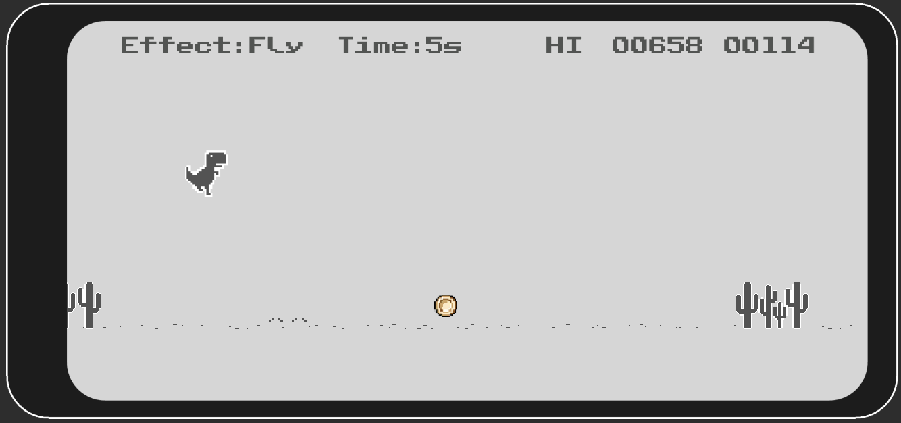
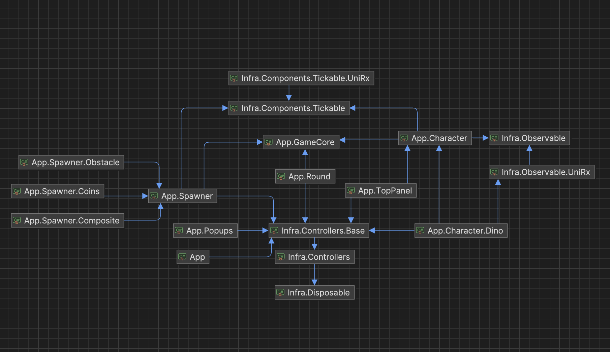
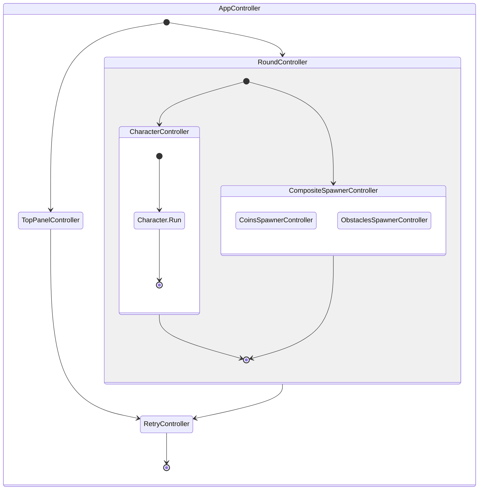

# Dino Runner

> The current project draws inspiration from the existing [**Dino Game (2D)**](https://github.com/zigurous/unity-dino-game-tutorial), but project has a fundamentally different design architecture.
> Additionally, this version introduces a coins feature that change character behavior.



- **Platforms**: Android, WebGL. see exists builds in folder 'Builds'
- **Version**: Unity 2021.3 (LTS)

### Project Structure

---

The project is organized into several key folder groups, each serving a distinct purpose within the overall architecture:

- `App`: Contains the core game logic, divided into isolated domains for clarity and maintainability.
    - _GameCore_
    - _Characters_
        - _Character_
        - _Character.Dino_
    - _TopPanel_
    - _Popups_
        - _Retry_
    - _Round_
    - _Spawner_
        - _Coins_
        - _Obstacle_
- `Infra`: Contains the infrastructure parts of the project, providing foundational services and utilities.
- `Plugins`: Third-party libraries and frameworks integrated to enhance development efficiency and game functionality.
    - [Zenject](https://github.com/modesttree/Zenject): A dependency injection framework.
    - [UniTask](https://github.com/Cysharp/UniTask/blob/master/README.md): An efficient asynchronous programming model.
    - [UniRx](https://github.com/neuecc/UniRx): Reactive extensions for Unity.

- `Tests`: Houses unit tests for the project, ensuring reliability and robustness.
    - Utilizes the [Moq](https://docs.unity3d.com/Packages/nuget.moq@2.0/manual/index.html) library for mocking dependencies in tests.

#### Project Structure Overview


### Game Logic

---
Application game logic  based on `IController` which can control others controls or control model with view via MVC pattern. 

```csharp
    /// <summary>
    /// Defines a generic controller interface with start and stop asynchronous operations.
    /// It also ensures cleanup by extending IDisposable.
    /// </summary>
    public interface IController : IDisposable
    {
        /// <summary>
        /// Starts the controller's operations asynchronously.
        /// </summary>
        /// <param name="token">A CancellationToken for cancelling the task if needed.</param>
        /// <returns>A UniTask representing the asynchronous start operation.</returns>
        UniTask Start(CancellationToken token = default);

        /// <summary>
        /// Stops the controller's operations asynchronously.
        /// </summary>
        /// <param name="token">A CancellationToken for cancelling the task if needed.</param>
        /// <returns>A UniTask representing the asynchronous stop operation.</returns>
        UniTask Stop(CancellationToken token = default);
    }
```


### Application Life Cycle

---


### IGameContext & ITickable

---
`IGameContext` provides access to global game context properties, such as game speed.

```csharp
    /// <summary>
    /// Provides access to global game context properties, such as game speed.
    /// </summary>
    public interface IGameContext
    {
        /// <summary>
        /// Gets the current game speed, affecting the overall pace of the game.
        /// </summary>
        float Speed { get; }
    }
```

`ITickable` defines a contract for objects that need to be updated every game frame.

```csharp
    /// <summary>
    /// Defines a contract for objects that need to be updated every game frame.
    /// </summary>
    public interface ITickable
    {
        /// <summary>
        /// Method to update the implementing object each game frame.
        /// </summary>
        /// <param name="deltaTime">The time elapsed since the last update call, in milliseconds.</param>
        void Update(float deltaTime);
    }
```


### ICharacter & ICharacterStateContext & CharacterState

---
`ICharacter` is main entry model interface for character.

```csharp
    /// <summary>
    /// Defines the behavior and properties of a character in the game, including actions like jump, run, and idle,
    /// and the ability to apply effects. It also integrates with the game's context for speed and character effect management.
    /// </summary>
    public interface ICharacter : IGameContext, ICharacterStateContext, IDisposable
    {
        /// <summary>
        /// Initiates a jump action for the character.
        /// </summary>
        /// <param name="token">A CancellationToken for cancelling the task if needed.</param>
        /// <returns>A UniTask that represents the asynchronous operation.</returns>
        UniTask Jump(CancellationToken token = default);

        /// <summary>
        /// Initiates a run action for the character.
        /// </summary>
        /// <param name="token">A CancellationToken for cancelling the task if needed.</param>
        /// <returns>A UniTask that represents the asynchronous operation.</returns>
        UniTask Run(CancellationToken token = default);
    
        /// <summary>
        /// Puts the character into an idle state.
        /// </summary>
        /// <param name="token">A CancellationToken for cancelling the task if needed.</param>
        /// <returns>A UniTask that represents the asynchronous operation.</returns>
        UniTask Idle(CancellationToken token = default);

        /// <summary>
        /// Applies an effect to the character based on the provided options.
        /// </summary>
        /// <param name="options">The options defining the effect to apply.</param>
        /// <param name="token">A CancellationToken for cancelling the task if needed.</param>
        /// <returns>A UniTask that represents the asynchronous operation.</returns>
        UniTask ApplyEffect(CharacterOptions options, CancellationToken token = default);
    }
```
`ICharacterStateContext` is interface to observable character state changes

```csharp
    /// <summary>
    /// Defines a context for observing and managing character states and their remaining durations.
    /// </summary>
    public interface ICharacterStateContext
    {
        /// <summary>
        /// Gets an observable value representing the current state applied to the character.
        /// </summary>
        IObservableValue<CharacterState> State { get; }
    
        /// <summary>
        /// An observable that emits the remaining duration of the current character state.
        /// </summary>
        IObservable<TimeSpan> TimeLeft { get; }
    }
```

`CharacterState` enumerates the different states that can be applied to a character's behavior or state.

```csharp
    /// <summary>
    /// Enumerates the different states that can be applied to a character's behavior or state.
    /// </summary>
    public enum CharacterState
    {
        /// <summary>
        /// Represents the default state, with no modifications applied.
        /// </summary>
        Default,

        /// <summary>
        /// Indicates that the character is in an idle state
        /// </summary>
        Idle,

        /// <summary>
        /// Applies a slow state to the character, reducing its movement speed or action speed.
        /// </summary>
        Slow,

        /// <summary>
        /// Applies a fast state to the character, increasing its movement speed or action speed.
        /// </summary>
        Fast,

        /// <summary>
        /// Enables the character to fly, possibly changing its mode of movement and interaction with the environment.
        /// </summary>
        Fly
    }
```

`CharacterOptions`  Represents the options for applying effects to a character, including the type of effect and its duration.
<details>
<summary>More details </summary>

    /// <summary>
    /// Enumerates the different states that can be applied to a character's behavior or state.
    /// </summary>
    public enum CharacterState
    {
        /// <summary>
        /// Represents the default state, with no modifications applied.
        /// </summary>
        Default,
        /// <summary>
        /// Indicates that the character is in an idle state
        /// </summary>
        Idle,

        /// <summary>
        /// Applies a slow state to the character, reducing its movement speed or action speed.
        /// </summary>
        Slow,

        /// <summary>
        /// Applies a fast state to the character, increasing its movement speed or action speed.
        /// </summary>
        Fast,

        /// <summary>
        /// Enables the character to fly, possibly changing its mode of movement and interaction with the environment.
        /// </summary>
        Fly
    }
</details>


