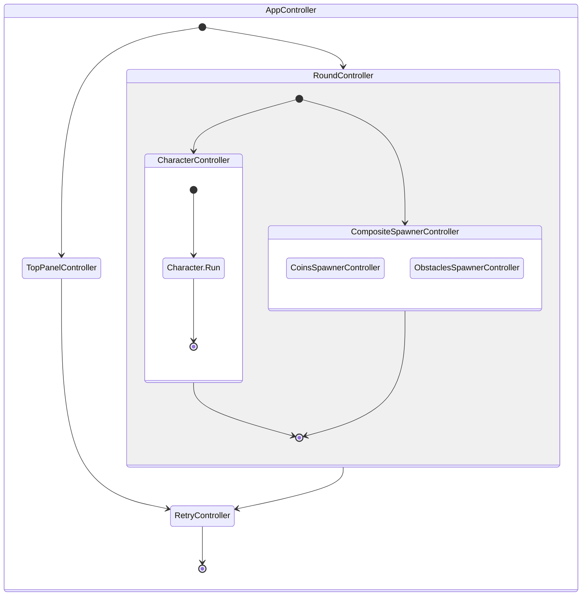

# Dino Runner

> Current project was inspired by exist [**Dino Game (2D)**](https://github.com/zigurous/unity-dino-game-tutorial) but completely has different design architecture implementation. Additionally game has coins feature which change character behavior.

- **Platforms**: Android, WebGL. see exists builds in folder 'Builds'
- **Version**: Unity 2021.3 (LTS)

### App Life Cycle

