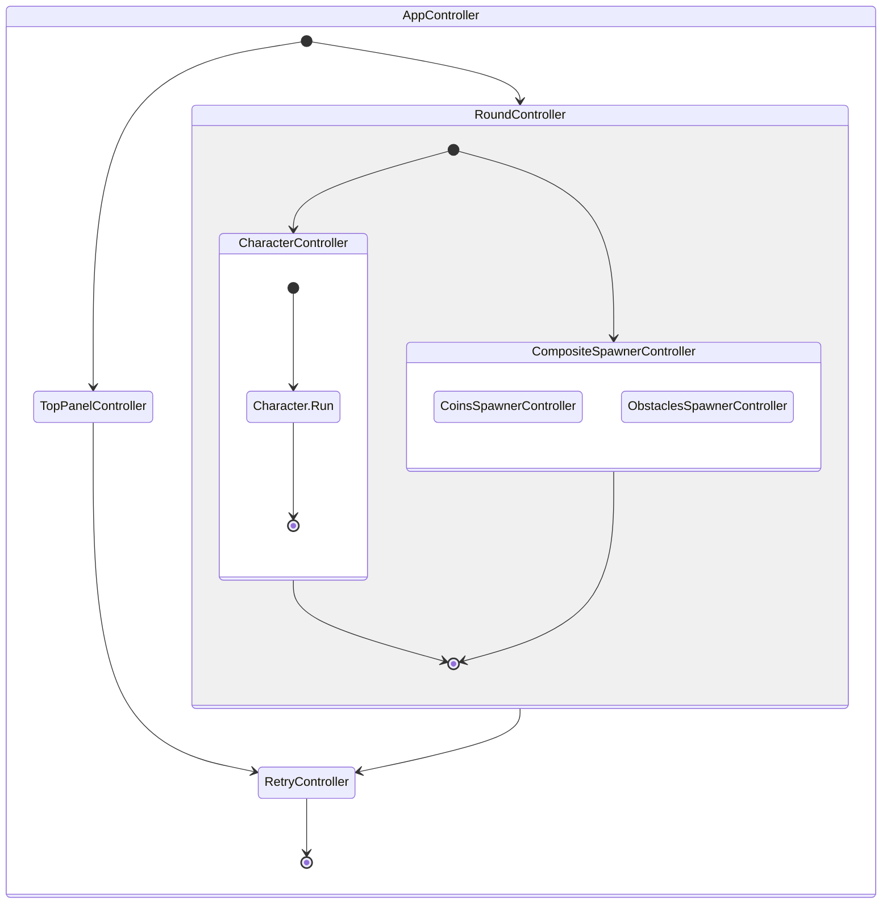

# Dino Runner

> Current project was inspired by exist [**Dino Game (2D)**](https://github.com/zigurous/unity-dino-game-tutorial) but completely has different design architecture implementation. Additionally game has coins feature which change character behavior.


- **Platforms**: Android, WebGL. see exists builds in folder 'Builds'
- **Version**: Unity 2021.3 (LTS)

### Project Structure

---

The project is organized into several key folder groups, each serving a distinct purpose within the overall architecture:

- `App`: Contains the core game logic, divided into isolated domains for clarity and maintainability.
    - _GameCore_
    - _Characters_
        - _Character_
        - _Character.Dino_
    - _TopPanel_
    - _Popups_
        - _Retry_
    - _Round_
    - _Spawner_
        - _Coins_
        - _Obstacle_

- `Plugins`: Third-party libraries and frameworks integrated to enhance development efficiency and game functionality.
    - [Zenject](https://github.com/modesttree/Zenject): A dependency injection framework.
    - [UniTask](https://github.com/Cysharp/UniTask/blob/master/README.md): An efficient asynchronous programming model.
    - [UniRx](https://github.com/neuecc/UniRx): Reactive extensions for Unity.

- `Infra`: Contains the infrastructure parts of the project, providing foundational services and utilities.

- `Tests`: Houses unit tests for the project, ensuring reliability and robustness.
    - Utilizes the [Moq](https://docs.unity3d.com/Packages/nuget.moq@2.0/manual/index.html) library for mocking dependencies in tests.

#### Project Structure Overview


### Game Logic

---
Application game logic  based on `IController` which can control others controls or control model with view via MVC pattern. 

```csharp
    /// <summary>
    /// Defines a generic controller interface with start and stop asynchronous operations.
    /// It also ensures cleanup by extending IDisposable.
    /// </summary>
    public interface IController : IDisposable
    {
        /// <summary>
        /// Starts the controller's operations asynchronously.
        /// </summary>
        /// <param name="token">A CancellationToken for cancelling the task if needed.</param>
        /// <returns>A UniTask representing the asynchronous start operation.</returns>
        UniTask Start(CancellationToken token = default);

        /// <summary>
        /// Stops the controller's operations asynchronously.
        /// </summary>
        /// <param name="token">A CancellationToken for cancelling the task if needed.</param>
        /// <returns>A UniTask representing the asynchronous stop operation.</returns>
        UniTask Stop(CancellationToken token = default);
    }
```


### Application Life Cycle

---

