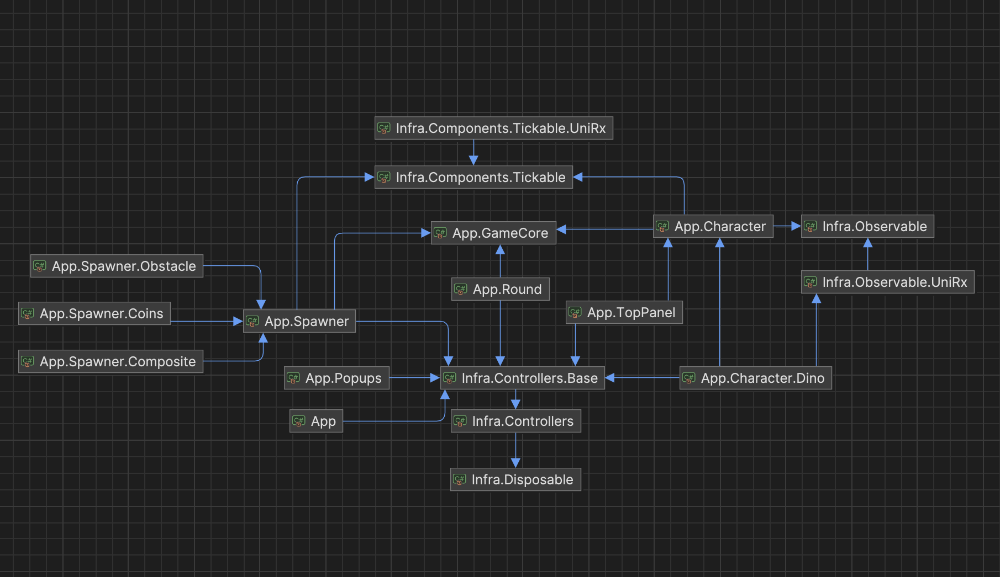
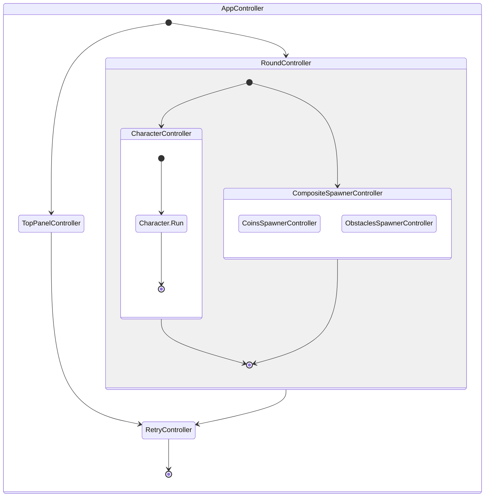
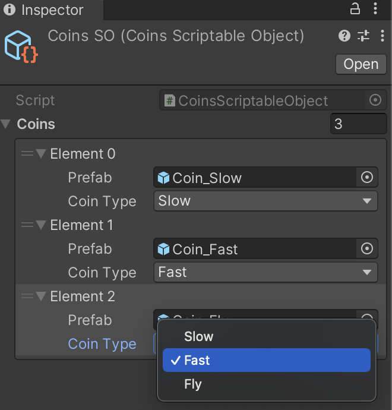

# Dino Runner

> The current project draws inspiration from the existing [**Dino Game (2D)**](https://github.com/zigurous/unity-dino-game-tutorial), but project has a fundamentally different design architecture.
> Additionally, this version introduces a coins feature that change character behavior.


- **Platforms**: Android, WebGL. see exists builds in folder 'Builds' or [**Play online**](https://ivan-kadyka.github.io/Runner/)
- **Version**: Unity 2021.3 (LTS)

## Project Structure

---
The project is organized into several key folder groups, each serving a distinct purpose within the overall architecture:

- `App`: Contains the core game logic, divided into isolated domains for clarity and maintainability.
    - _GameCore_
    - _Characters_
        - _Character_
        - _Character.Dino_
    - _TopPanel_
    - _Popups_
        - _Retry_
    - _Rounds_
      - _Round_
    - _Spawners_
        - _Spawner_
        - _Coins_
        - _Obstacle_
        - _Composite_
- `Infra`: Contains the infrastructure parts of the project, providing foundational services and utilities.
- `Plugins`: Third-party libraries and frameworks integrated to enhance development efficiency and game functionality.
    - [Zenject](https://github.com/modesttree/Zenject): A dependency injection framework.
    - [UniTask](https://github.com/Cysharp/UniTask): An efficient asynchronous programming model. P.S. Added in project via upm.
    - [UniRx](https://github.com/neuecc/UniRx): Reactive extensions for Unity.

- `Tests`: Houses unit tests for the project, ensuring reliability and robustness.
    - Utilizes the [Moq](https://docs.unity3d.com/Packages/nuget.moq@2.0/manual/index.html) library for mocking dependencies in tests.

### Project Structure Overview


## Game Logic

---
Application game logic  based on `IController` which can control others controls or control model with view via MVC pattern. 

```csharp
    /// <summary>
    /// Defines a generic controller interface with start and stop asynchronous operations.
    /// It also ensures cleanup by extending IDisposable.
    /// </summary>
    public interface IController : IDisposable
    {
        /// <summary>
        /// Starts the controller's operations asynchronously.
        /// </summary>
        /// <param name="token">A CancellationToken for cancelling the task if needed.</param>
        /// <returns>A UniTask representing the asynchronous start operation.</returns>
        UniTask Start(CancellationToken token = default);

        /// <summary>
        /// Stops the controller's operations asynchronously.
        /// </summary>
        /// <param name="token">A CancellationToken for cancelling the task if needed.</param>
        /// <returns>A UniTask representing the asynchronous stop operation.</returns>
        UniTask Stop(CancellationToken token = default);
    }
```


## Application Life Cycle

---


### Game Core

---
`IGameContext` provides access to global game context properties, such as game speed.

```csharp
    /// <summary>
    /// Provides access to global game context properties, such as game speed.
    /// </summary>
    public interface IGameContext
    {
        /// <summary>
        /// Gets the current game speed, affecting the overall pace of the game.
        /// </summary>
        float Speed { get; }
    }
```

`ITickable` defines a contract for objects that need to be updated every game frame.

```csharp
    /// <summary>
    /// Defines a contract for objects that need to be updated every game frame.
    /// </summary>
    public interface ITickable
    {
        /// <summary>
        /// Method to update the implementing object each game frame.
        /// </summary>
        /// <param name="deltaTime">The time elapsed since the last update call, in milliseconds.</param>
        void Update(float deltaTime);
    }
```

`IObject` Defines a basic interface for game data objects

```csharp
     /// <summary>
    /// Defines a basic interface for game objects, allowing for the identification
    /// of the object's type within the game's ecosystem.
    /// </summary>
    public interface IObject
    {
        /// <summary>
        /// Gets the type of the object, as defined by the ObjectType enum.
        /// This property allows for easy identification and categorization of game objects.
        /// </summary>
        ObjectType ObjectType { get; }
    }
```

`ObjectType` Defines a basic interface for game data objects

```csharp
    /// <summary>
    /// Enumerates different types of objects that can exist within the game
    /// </summary>
    public enum ObjectType
    {
        /// <summary>
        /// Represents an object type that is not known or specified.
        /// </summary>
        Unknown,

        /// <summary>
        /// Represents a character
        /// </summary>
        Character,

        /// <summary>
        /// Represents an obstacle that players must avoid or overcome.
        /// </summary>
        Obstacle,

        /// <summary>
        /// Represents a coin or collectible that players can collect for rewards or points.
        /// </summary>
        Coin,
    }
```


### Character

---
`ICharacter` is main entry model interface for character.

```csharp
    /// <summary>
    /// Defines the behavior and properties of a character in the game, including actions like jump, run, and idle,
    /// and the ability to apply effects. It also integrates with the game's context for speed and character effect management.
    /// </summary>
    public interface ICharacter : IGameContext, ICharacterEffectsContext, IDisposable
    {
        /// <summary>
        /// Initiates a jump action for the character.
        /// </summary>
        /// <param name="token">A CancellationToken for cancelling the task if needed.</param>
        /// <returns>A UniTask that represents the asynchronous operation.</returns>
        UniTask Jump(CancellationToken token = default);

        /// <summary>
        /// Initiates a run action for the character.
        /// </summary>
        /// <param name="token">A CancellationToken for cancelling the task if needed.</param>
        /// <returns>A UniTask that represents the asynchronous operation.</returns>
        UniTask Run(CancellationToken token = default);
    
        /// <summary>
        /// Puts the character into an idle state.
        /// </summary>
        /// <param name="token">A CancellationToken for cancelling the task if needed.</param>
        /// <returns>A UniTask that represents the asynchronous operation.</returns>
        UniTask Idle(CancellationToken token = default);

        /// <summary>
        /// Applies an effect to the character based on the provided options.
        /// </summary>
        /// <param name="behavior">Character effect behavior</param>
        /// <param name="options">The options defining the effect to apply.</param>
        /// <param name="token">A CancellationToken for cancelling the task if needed.</param>
        /// <returns>A UniTask that represents the asynchronous operation.</returns>
        UniTask ApplyEffectBehavior(ICharacterBehavior behavior, EffectStartOptions options, CancellationToken token = default);
    }
```
`ICharacterEffectsContext` is interface to observable character effect changes

```csharp
    /// <summary>
    /// Defines a context for observing and managing character effects and their remaining updates.
    /// </summary>
    public interface ICharacterEffectsContext
    {
        /// <summary>
        /// Gets an observable collection representing the current effects applied to the character.
        /// </summary>
        IObservableValue<IReadOnlyCollection<CharacterEffect>> Effects { get; }
        
        /// <summary>
        /// An observable that emits the remaining duration of the current character state.
        /// </summary>
        IObservable<EffectUpdateOptions> Updated { get; }
    }
```

`CharacterEffect` enumerates the different effects that can be applied to a character's behavior or state.

```csharp
    /// <summary>
    /// Enumerates the different effects that can be applied to a character's behavior or state.
    /// </summary>
    public enum CharacterEffect
    {
        /// <summary>
        /// Represents the default effect, with no modifications applied.
        /// </summary>
        Default,

        /// <summary>
        /// Indicates that the character is in an idle effect
        /// </summary>
        Idle,

        /// <summary>
        /// Applies a slow effect to the character, reducing its movement speed or action speed.
        /// </summary>
        Slow,

        /// <summary>
        /// Applies a fast effect to the character, increasing its movement speed or action speed.
        /// </summary>
        Fast,

        /// <summary>
        /// Enables the effect to fly, possibly changing its mode of movement and interaction with the environment.
        /// </summary>
        Fly
    }
```

`EffectStartOptions`  Represents the options for applying  effects on start to a character, including the type of effect and its duration.
<details>
<summary>More details </summary>
    /// <summary>
    /// Represents the options for applying effects to a character, including the type of effect and its duration.
    /// </summary>
    public class EffectStartOptions
    {
        /// <summary>
        /// Gets the type of effect to be applied to the character.
        /// </summary>
        public CharacterEffect Type { get; }
    
        /// <summary>
        /// Gets the duration for which the effect is applied.
        /// </summary>
        public TimeSpan Duration { get; }

        /// <summary>
        /// Initializes a new instance of the EffectStartOptions class with specified effect type and duration.
        /// </summary>
        /// <param name="type">The type of character effect.</param>
        /// <param name="duration">The duration of the effect.</param>
        public EffectStartOptions(CharacterEffect type, TimeSpan duration)
        {
            Type = type;
            Duration = duration;
        }
    }
</details>

`EffectUpdateOptions`  Represents the options for applying  effect updates to a character, including the type of effect and its time left.
<details>
<summary>More details </summary>
/// <summary>
/// Represents the options for updating character effects, including the type of effect and the remaining time for that effect.
/// </summary>
public struct EffectUpdateOptions
{
    /// <summary>
    /// Gets the specific character effect being applied.
    /// </summary>
    public CharacterEffect Effect { get; private set; }

    /// <summary>
    /// Gets the time span indicating how much time is left until the effect expires.
    /// </summary>
    public TimeSpan TimeLeft { get; private set; }

    /// <summary>
    /// Initializes a new instance of the EffectUpdateOptions struct with specified effect type and time left.
    /// </summary>
    /// <param name="effect">The character effect type.</param>
    /// <param name="timeLeft">The remaining duration of the effect.</param>
    public EffectUpdateOptions(CharacterEffect effect, TimeSpan timeLeft)
    {
        Effect = effect;
        TimeLeft = timeLeft;
    }
}

</details>

## How to add new coin

---

1. Add new coin type in `CoinType`

```csharp
    /// <summary>
    /// Enumerates the types of coins, each associated with a specific effect
    /// or characteristic that can be applied to or influence the game's characters or environment.
    /// </summary>
    public enum CoinType
    {
        /// <summary>
        /// Represents a slow effect, possibly reducing movement or action speed.
        /// </summary>
        Slow,

        /// <summary>
        /// Represents a fast effect, increasing movement or action speed.
        /// </summary>
        Fast,

        /// <summary>
        /// Represents fly effect, allowing for aerial movement or other fly-related abilities.
        /// </summary>
        Fly,
    }
```

2. Use exists MonoBehaviour `CoinView` or create own by implementing interface `ISpawnView`

```csharp
    /// <summary>
    /// Extends the IView interface to define specific behavior for spawn views
    /// </summary>
    public interface ISpawnView : IView, IObjectView
    {
        /// <summary>
        /// Gets or sets a value indicating whether the spawn view is active.
        /// </summary>
        bool IsActive { get; set; }

        /// <summary>
        /// Sets up the spawn view with necessary game context and assigns a name to the view.
        /// </summary>
        /// <param name="gameContext">The game context to associate with the spawn view.</param>
        /// <param name="spawnObject">The spawn game object</param>
        void SetUp(IGameContext gameContext, IObject spawnObject);
    }
```

3. Attach your `CoinView` or your MonoBehaviour to root selected prefab

4. Set up scriptable object `CoinsSO.asset`, add in list your prefab game object and CoinType.



## How to add new character behavior

---

1. Add new character effect type in `CharacterEffect`

```csharp
    /// <summary>
    /// Enumerates the different effects that can be applied to a character's behavior or state.
    /// </summary>
    public enum CharacterEffect
    {
        /// <summary>
        /// Represents the default effect, with no modifications applied.
        /// </summary>
        Default,

        /// <summary>
        /// Indicates that the character is in an idle effect
        /// </summary>
        Idle,

        /// <summary>
        /// Applies a slow effect to the character, reducing its movement speed or action speed.
        /// </summary>
        Slow,

        /// <summary>
        /// Applies a fast effect to the character, increasing its movement speed or action speed.
        /// </summary>
        Fast,

        /// <summary>
        /// Enables the effect to fly, possibly changing its mode of movement and interaction with the environment.
        /// </summary>
        Fly
    }
```

2. Implement  `ICharacterBehavior` interface with your logic

```csharp
    /// <summary>
    /// Extends the ITickable interface to define behaviors specific to a character,
    /// including execution of behavior-specific actions and managing speed.
    /// </summary>
    public interface ICharacterBehavior : ITickable
    {
        /// <summary>
        /// Gets the speed associated with the character's current behavior.
        /// </summary>
        float Speed { get; }
    
        /// <summary>
        /// Executes the behavior's main action asynchronously.
        /// </summary>
        /// <param name="token">A CancellationToken for cancelling the task if needed.</param>
        /// <returns>A UniTask that represents the asynchronous operation of the behavior's execution.</returns>
        UniTask Execute(CancellationToken token = default);
    }
```

3. Register created yours new implemented types `ICharacterBehavior` & `CharacterEffect`  in  factory `CharacterBehaviorFactory`
```csharp
        //Example
        public ICharacterBehavior Create(CharacterEffect type)
        {
            switch (type)
            {
                ...
                case CharacterEffect.Fly:
                {
                    var jumpBehavior = _jumpBehaviorFactory.Create(JumpBehaviorType.Fly);
                    return new CharacterBehavior(jumpBehavior, options.Speed);
                }
                ...
            }
        }
```


4. Create strategy with your `ICharacterBehavior` and, for example coin type, in `CharacterController`
```csharp
        //Example
        private async UniTask CoinEffectBehaviorStrategy(CoinType coinType)
        {
            switch (coinType)
            {
                ...
                case CoinType.Fly:
                {
                    var duration = TimeSpan.FromSeconds(10);
                    var options = new EffectOptions(CharacterEffect.Fly, duration);
                    
                    var newBehavior = _behaviorFactory.Create(options.Type);
                    await _character.ApplyEffectBehavior(newBehavior, options);
                    break;  
                }
                ...
            }
        }
```