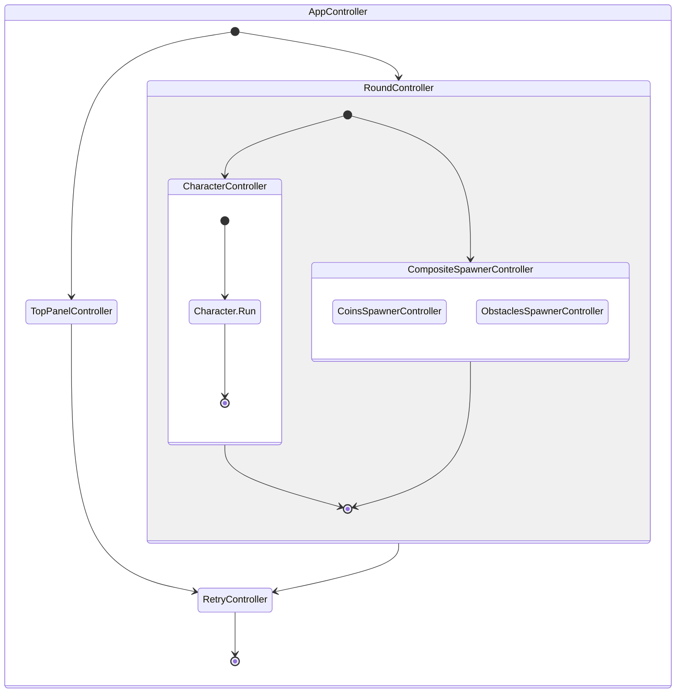

# Dino Runner

> Current project was inspired by exist [**Dino Game (2D)**](https://github.com/zigurous/unity-dino-game-tutorial) but completely has different design architecture implementation. Additionally game has coins feature which change character behavior.


- **Platforms**: Android, WebGL. see exists builds in folder 'Builds'
- **Version**: Unity 2021.3 (LTS)
- **Plugins/Packages**: [UniTask](https://github.com/Cysharp/UniTask/blob/master/README.md),
[Zenject](https://github.com/modesttree/Zenject), [UniRx](https://github.com/neuecc/UniRx)


### Game Logic

---
Application game logic  based on `IController` which can control others controls or control model with view via MVC pattern. 

```csharp
    /// <summary>
    /// Defines a generic controller interface with start and stop asynchronous operations.
    /// It also ensures cleanup by extending IDisposable.
    /// </summary>
    public interface IController : IDisposable
    {
        /// <summary>
        /// Starts the controller's operations asynchronously.
        /// </summary>
        /// <param name="token">A CancellationToken for cancelling the task if needed.</param>
        /// <returns>A UniTask representing the asynchronous start operation.</returns>
        UniTask Start(CancellationToken token = default);

        /// <summary>
        /// Stops the controller's operations asynchronously.
        /// </summary>
        /// <param name="token">A CancellationToken for cancelling the task if needed.</param>
        /// <returns>A UniTask representing the asynchronous stop operation.</returns>
        UniTask Stop(CancellationToken token = default);
    }
```


### Application Life Cycle

---

